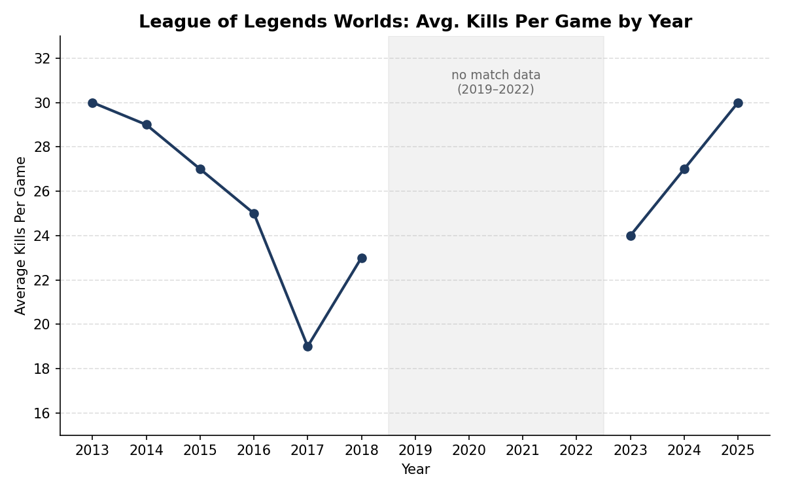

# League of Legends Worlds Championship: SQL Analysis

**Why this dataset:** I've been playing League of Legends since childhood. It was one of my first games, and watching Worlds tournaments with my family is a long-running tradition. When I started building SQL projects, this was the dataset I was most motivated to actually dig into.

**What's in it:** 9 related tables covering Worlds tournaments from 2011 to 2025: tournament summaries, group stage standings, knockout bracket results, grand final results, prize pool distribution, venues and match statistics. Tables are connected primarily through `year` and `team` name.

**A real data-quality bug I found and fixed:** While joining `final_placements` to `knockout_bracket_results` on team name, my query returned fewer rows than expected. I investigated and found the source data had inconsistent capitalization in team names across files (e.g. `"against All Authority"` vs. `"against All authority"`), which was silently causing exact-match joins to drop valid rows. I fixed it by normalizing both sides of the join with `LOWER()`, and confirmed the fix by comparing row counts before and after: 64 rows became 66, capturing the previously missed matches.

**Key finding, teams that placed but never won:** Using a LEFT JOIN between `final_placements` and `grand_final_results`, I found 36 team-year combinations where a team placed in the tournament but never won a Grand Final, including repeat entries from teams like Gen.G, Weibo Gaming and Bilibili Gaming, showing up in multiple different years without ever breaking through. As someone who's followed this competitive scene for years, this was the most striking result: it quantifies something I'd only ever felt watching the matches, that Korea and China's dominance isn't a one-off, it's a structural, year-over-year gap that most other top-tier teams never close, no matter how much they improve.

**Key finding, kills-per-game over time:** I looked at whether average kills-per-game (KPG) changed over the tournament's history, curious whether veteran player experience would show up as rising kill output, or whether the field would rise together and cancel it out. Match statistics are unavailable for 2011, 2012, 2019, 2020, 2021 and 2022 in the source dataset (the years exist in the tournament records but have no corresponding match-level data. I verified this with a NOT IN subquery confirming those years return zero rows in `match_statistics`, rather than being silently counted as zero or null). For the years where data exists, KPG declined steadily every year from 2013 to 2017, 30, 29, 27, 25, then 19, before jumping to 23 in 2018. It then climbed steadily again from 2023 onward: 24, 27, then 30 in 2025, landing at exactly the same average as 2013. With two separate multi-year gaps in the middle of the timeline, I can't call this one continuous trend across the full history, but the 2013-to-2025 bookend and the clean climb on both sides of the 2019-2022 gap are real patterns worth noting.

 

## Tools

- PostgreSQL 18
- pgAdmin 4
